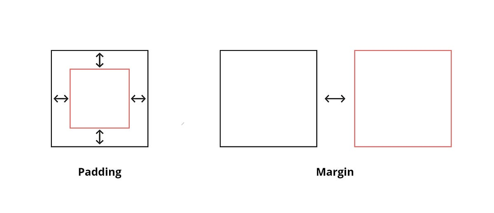

# A.2 CSS Fundamentals

## 1. CSS Selectors: element, class, id, attribute, pseudo-classes, pseudo-elements

```css
/* Element */
p {
    color: blue;
}

/* Class */
.box {
    background: gray;
}

/* ID */
#header {
    font-size: 24px;
}

/* Attribute */
input[type="text"] {
    border: 1px solid black;
}

/* Pseudo-class */
a:hover {
    color: red;
}

/* Pseudo-element */
p::first-letter {
    font-size: 30px;
}
```

- element – Selects all elements of a specific type.
- class – Selects elements with a specific class.
- id – Selects a unique element with a specific id.
- attribute – Selects elements based on attribute value.
- pseudo-class – Targets elements in a specific state (hover, focus).
- pseudo-element – Styles specific parts of an element (::before, ::after).

## 2. Specificity and Cascade

- Cascade decides which CSS rule applies when multiple rules target the same element.
- Specificity defines the priority of selectors.

### Specificity Calculation:

- Inline style = 1000
- ID = 100
- Class / Attribute / Pseudo-class = 10
- Element = 1

```css
#id {
    color: red;
}
.box {
    color: blue;
}
p {
    color: green;
}
```

Higher specificity overrides lower specificity.

---

## 3. Box Model: content, padding, border, margin

```
Margin
  Border
    Padding
      Content
```

- content – The actual text or image inside the element.
- padding – Space between content and border.
- border – Surrounds the padding and content.
- margin – Space outside the border.

---

## 4. box-sizing: content-box vs border-box

```css
box-sizing: content-box;
box-sizing: border-box;
```

- content-box – Width and height include only content (default).
- border-box – Width and height include content + padding + border.

---

## 5. Display properties: block, inline, inline-block, none

```css
display: block;
display: inline;
display: inline-block;
display: none;
```

- block – Takes full width and starts on new line.
- inline – Takes only required width and stays inline.
- inline-block – Inline but allows width and height.
- none – Removes element from layout completely.

---

## 6. Position: static, relative, absolute, fixed, sticky

```css
position: static;
position: relative;
position: absolute;
position: fixed;
position: sticky;
```

- static – Default position.
- relative – Moves relative to its normal position.
- absolute – Positioned relative to nearest positioned ancestor.
- fixed – Positioned relative to viewport.
- sticky – Toggles between relative and fixed during scroll.

---

## 7. Flexbox

```css
display: flex;
flex-direction: row;
flex-wrap: wrap;
flex-flow: row wrap;
justify-content: center;
align-items: center;
align-content: center;
gap: 10px;
row-gap: 10px;
column-gap: 20px;
```

### Flex Container Properties

- display – Defines a flex container using `display: flex`.
- flex-direction – Sets main axis direction (row, row-reverse, column, column-reverse).
- flex-wrap – Controls wrapping of items (nowrap, wrap, wrap-reverse).
- flex-flow – Shorthand for flex-direction and flex-wrap.
- justify-content – Aligns items along the main axis.
- align-items – Aligns items along the cross axis.
- align-content – Aligns multiple rows when there is extra space.
- gap – Adds spacing between flex items.
- row-gap – Adds vertical spacing between rows.
- column-gap – Adds horizontal spacing between columns.

---

### Flex Item Properties

```css
order: 1;
flex-grow: 1;
flex-shrink: 1;
flex-basis: 200px;
flex: 1 1 200px;
align-self: center;
```

- order – Changes the order of a flex item.
- flex-grow – Defines how much the item should grow.
- flex-shrink – Defines how much the item should shrink.
- flex-basis – Sets the initial size of the item.
- flex – Shorthand for flex-grow, flex-shrink, and flex-basis.
- align-self – Overrides align-items for a specific item.

## 8. Grid

```css
display: grid;
grid-template-columns: 1fr 1fr;
grid-template-rows: 100px auto;
grid-template-areas: "header header";
gap: 10px;
row-gap: 10px;
column-gap: 20px;
justify-content: center;
align-content: center;
justify-items: center;
align-items: center;
place-items: center;
```

### Grid Container Properties

- display – Defines a grid container using `display: grid`.
- grid-template-columns – Defines the number and size of columns.
- grid-template-rows – Defines the number and size of rows.
- grid-template-areas – Defines named layout areas.
- gap – Sets spacing between rows and columns.
- row-gap – Sets spacing between rows.
- column-gap – Sets spacing between columns.
- justify-content – Aligns the entire grid horizontally.
- align-content – Aligns the entire grid vertically.
- justify-items – Aligns items horizontally inside their cells.
- align-items – Aligns items vertically inside their cells.
- place-items – Shorthand for align-items and justify-items.

---

### Grid Item Properties

```css
grid-column: 1 / 3;
grid-row: 1 / 2;
grid-area: header;
justify-self: center;
align-self: center;
place-self: center;
```

- grid-column – Defines the column start and end position.
- grid-row – Defines the row start and end position.
- grid-area – Assigns the item to a named grid area.
- justify-self – Aligns a specific item horizontally inside its cell.
- align-self – Aligns a specific item vertically inside its cell.
- place-self – Shorthand for align-self and justify-self.

## 9. Units: px, %, em, rem, vh, vw

- px – Fixed pixel unit.
- % – Relative to parent element.
- em – Relative to parent font size.
- rem – Relative to root (html) font size.
- vh – Relative to viewport height.
- vw – Relative to viewport width.

---

## 10. Responsive Design: media queries, mobile-first approach

```css
@media (max-width: 768px) {
    body {
        background: lightblue;
    }
}
```

- media queries – Apply styles based on screen size or device type.
- mobile-first – Start designing for small screens, then scale up.

---

## CSS Specificity Calculation

### Specificity Order

- Inline style → 1000
- ID selector → 100
- Class / Attribute / Pseudo-class → 10
- Element selector → 1

Higher value = Higher priority.

---

### Example

```html
<p id="para" class="text">Hello World</p>
```

```css
p {
  color: green;        /* Specificity = 1 */
}

.text {
  color: blue;         /* Specificity = 10 */
}

#para {
  color: red;          /* Specificity = 100 */
}

<p style="color: orange;">
```

---

### Specificity Calculation

- `p` → 1
- `.text` → 10
- `#para` → 100
- `style=""` → 1000

Final applied color → **orange** (Inline style wins).

If inline is removed → **red** (ID wins).

---

## Combined Selector Example

```css
div #para.text {
    color: purple;
}
```

Calculation:

- div → 1
- #para → 100
- .text → 10

Total = 111

This rule will override a selector with lower specificity.

## Interview Questions

## 1. Explain the CSS box model with a diagram

- The box model consists of content, padding, border, and margin.
- Content is the inner data.
- Padding adds inner spacing.
- Border wraps around padding.
- Margin creates outer spacing.
  

---

## What is CSS specificity and how is it calculated?

- Specificity determines which CSS rule is applied when multiple rules target the same element.
- It is calculated as: Inline (1000) > ID (100) > Class (10) > Element (1).
- Higher specificity overrides lower specificity.

---

### Example

```html
<p id="heading" class="title">Hello CSS</p>
```

```css
p {
    color: green; /* Specificity = 1 */
}

.title {
    color: blue; /* Specificity = 10 */
}

#heading {
    color: red; /* Specificity = 100 */
}
```

### Specificity Calculation:

- `p` → 1
- `.title` → 10
- `#heading` → 100

Final applied color → **red** (ID selector has highest specificity).

If we add inline style:

```html
<p id="heading" class="title" style="color: orange;">Hello CSS</p>
```

Inline specificity → 1000

Final applied color → **orange**.

---

## 3. Difference between margin and padding with visual examples

- Margin creates space outside the border.
- Padding creates space inside the border.
- Padding affects background color.
- Margin does not affect background.

---

## 4. How does position: relative vs absolute work?

- relative moves the element from its normal position.
- absolute removes the element from normal flow.
- absolute positions relative to nearest positioned ancestor, if no ancestor available then it will w.r.t root element

---

## 5. What is the difference between display: none and visibility: hidden?

- display: none removes the element completely from layout.
- visibility: hidden hides the element but keeps its space.

---

## 6. How do you center elements horizontally and vertically?

Using Flexbox:

```css
display: flex;
justify-content: center;
align-items: center;
```

Using Grid:

```css
display: grid;
place-items: center;
```

Using margin (horizontal only):

```css
margin: 0 auto;
```
