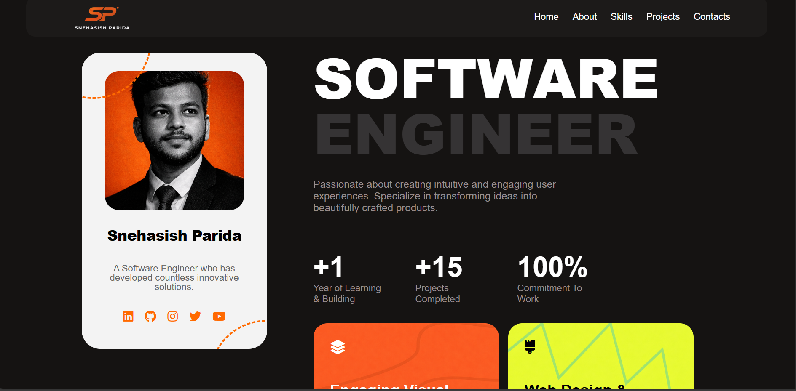

#  Snehasish Parida – Portfolio Website

A modern and fully responsive personal portfolio website built using **HTML5 and CSS3**.

This portfolio showcases my skills, projects, tools, and contact information with a clean and minimal user interface.

---

## Preview

 

---

## Features

- Fully Responsive Design (Desktop, Tablet, Mobile)
- Sticky Navigation Bar
- Sidebar Profile Section
- Hero Section with Experience Highlights
- Recent Projects Showcase
- Tools & Tech Stack Section
- Contact Form UI
- Clean & Modern Layout
- Optimized Spacing & Alignment

---

## Tech Stack

- HTML5
- CSS3
- Flexbox
- Media Queries
- Font Awesome
- Google Fonts (Poppins)

---

